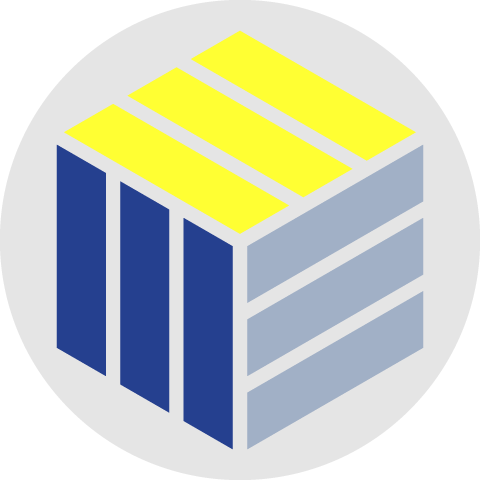

# Welcome



This is my personal portfolio that I created using [React](https://reactjs.org/), [Gatsby](https://www.gatsbyjs.com/), [GraphQL](https://graphql.org/), [Sass](https://sass-lang.com/), and [Markdown](https://commonmark.org/).

## Branches

The branch `main` contains all of the built code necessary for deploying the site.

When originally creating my personal site, I used `source` as the primary branch for maintaining all of the non-built code.

However, I ended up not liking the way things were turning out. I decided to reboot my site using Gatsby. In order to retain all of the original code, I separated all of the Gatsby related work into its own branch: `gatsby-md` (as in, Gatsby + Markdown).

As my site becomes more complex, I will likely integrate a CMS like [Sanity](https://www.sanity.io/) and thus will create another branch to contain that source code (probably `gatsby-sanity`).

## Deployment

In the event I forget (or **_die_**), here's how to deploy the site to GitHub Pages:

```shell
git clone https://github.com/nicksinclair/nicksinclair.github.io.git
cd nicksinclair.github.io
git checkout gatsby-md
npm i
```

After making changes:

```shell
git add -A
git commit -m "Message about changes"
git push
npm run deploy
```
