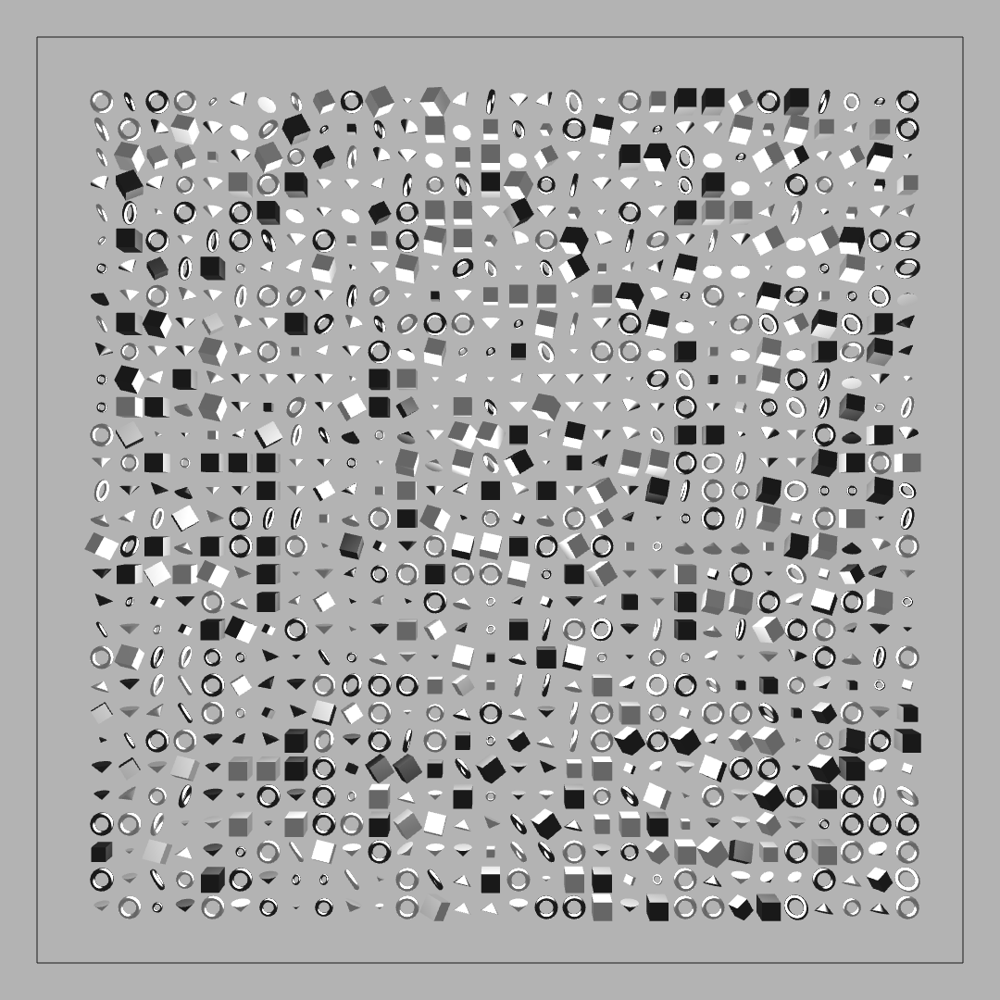
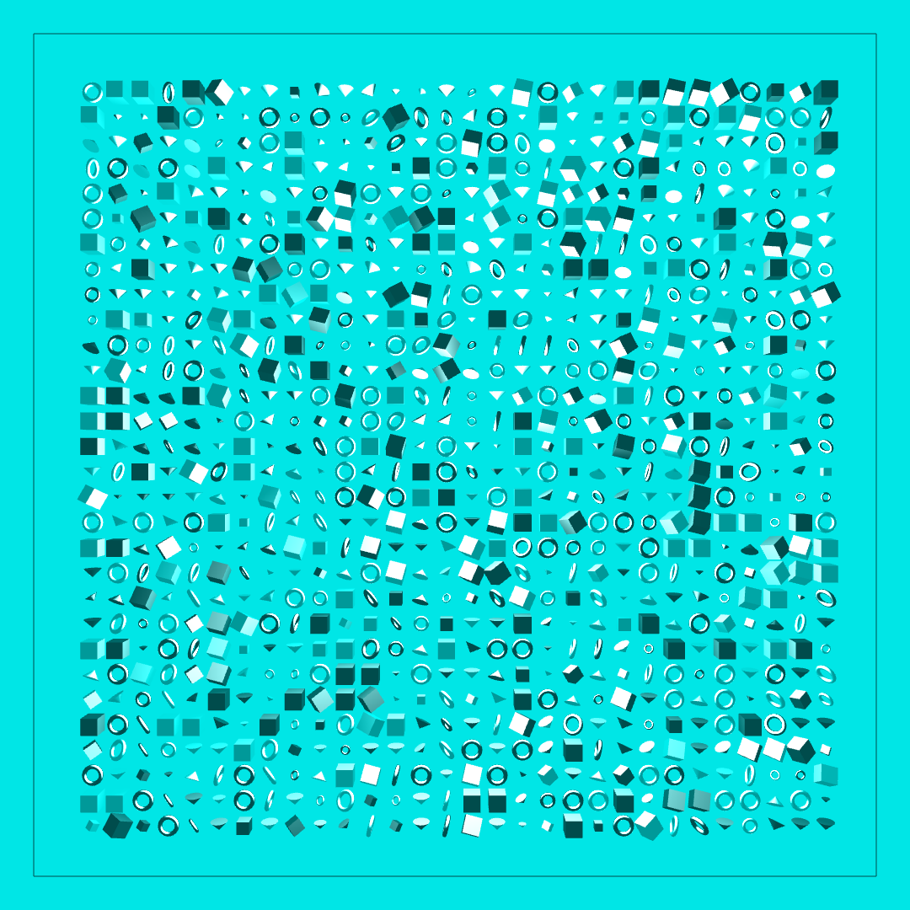
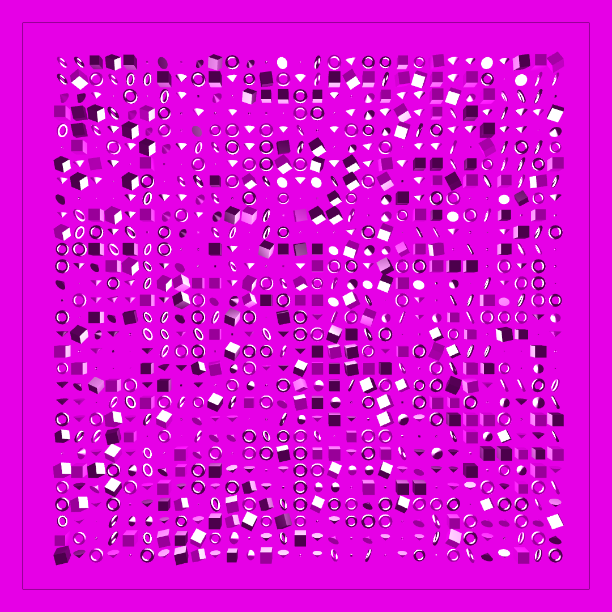
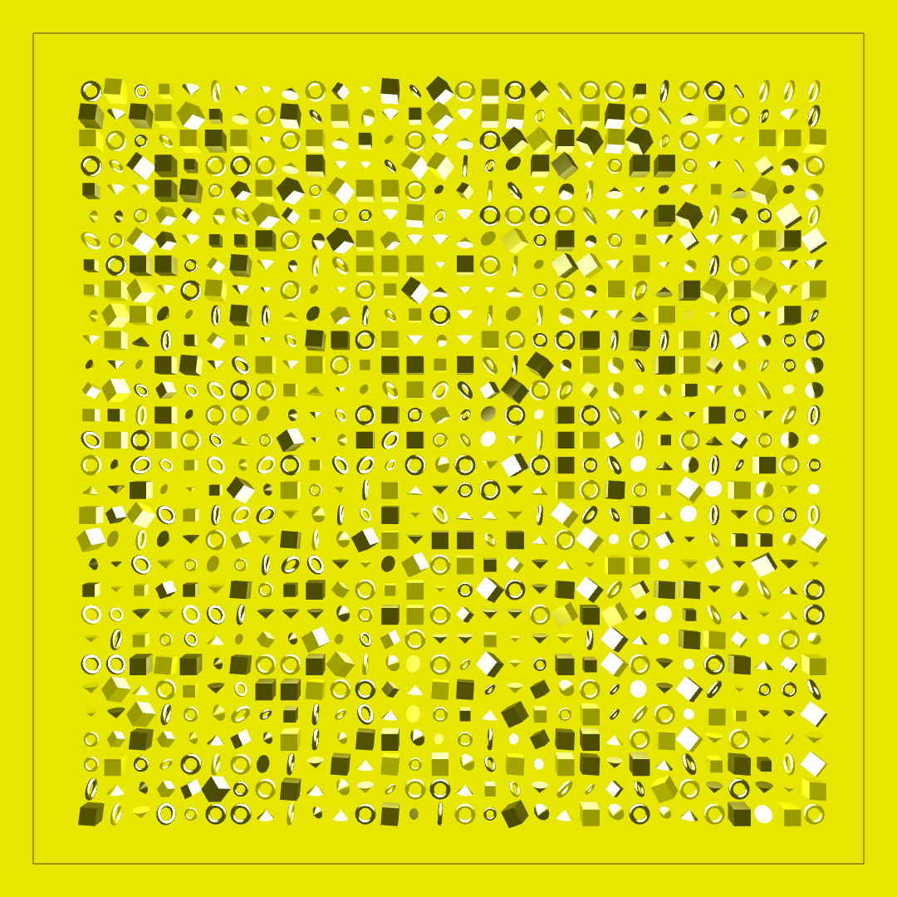

::: section block

## Details

[Interactive Website](https://nicksinclair.github.io/form-grid)

The perfomance of this project is significantly better than that of [Shape Grid](https://nicksinclair.github.io/projects/shape-grid) due to its use of p5's WebGL renderer.

:::

::: section full-image

## Gray

:::

::: section full-image

## Cyan

:::

::: section full-image

## Magenta

:::

::: section full-image

## Yellow

:::
