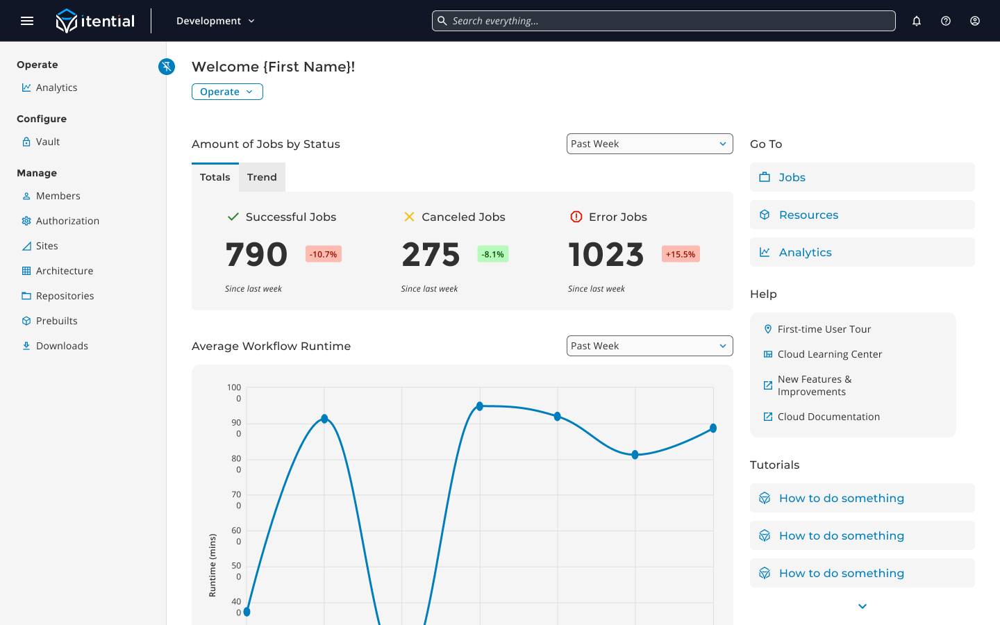
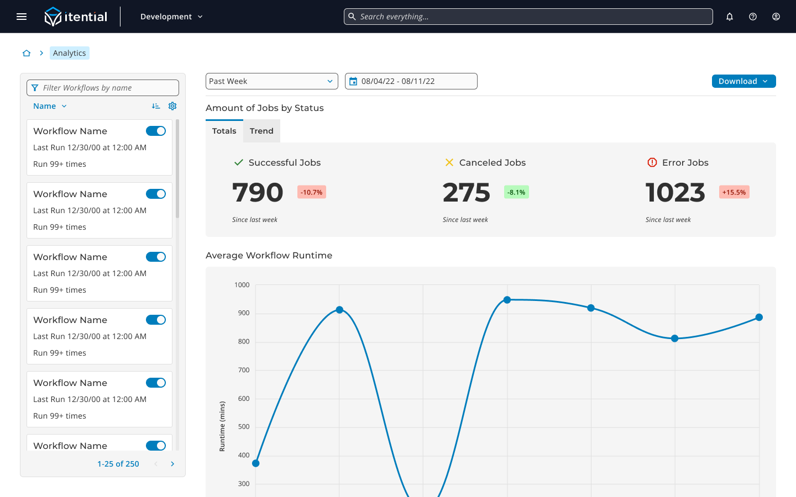
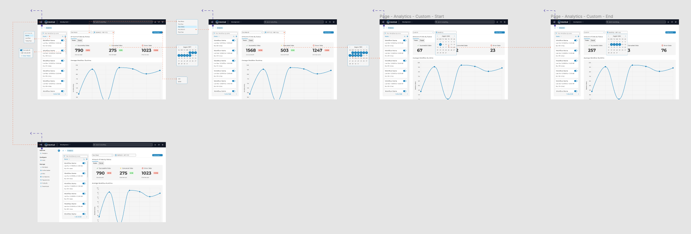
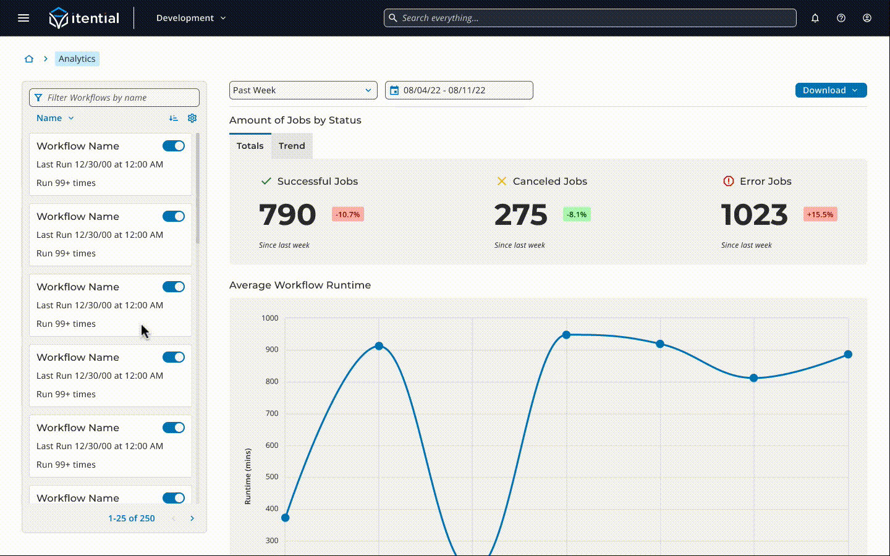

::: section block

## Context

As automation increases in popularity as a solution to network management across organizations, network architects and executives want to **ensure that their investment into automation tools continues to be worthwhile**. Additionally, network operators need **meaningful data** to understand how the automations that network engineers build are performing. This so that networking teams can continue to iterate on the design of these automations to best fit their needs.

With Itential moving many of the capabilities of its on-premise product offering into a cloud-based architecture, there is an opportunity to address some of these needs with metrics that the platform already tracks.

:::

::: section block

## Solution

The vision for the Operate Workspace is for it to be **an all-in-one view where network operators can manage running automations and understand job analytics**. The various workspace dashboards that are a part of Itential's cloud offering house a number of widgets that key in on the information that each persona cares most about.

This project highlights the Analytics page within the Operate Workspace, which is **a dedicated view for displaying historical data about previous automation runs**. The visualizations created for this page show time series trends for the amount of jobs organized by status as well as the average workflow runtime. Each visualization is bubbled up to the workspace dashboard as a simplified widget in order to give operators **a high-level overview of job performance at a glance**. The job data fed into these visualizations can be filtered to include and exclude specific automation use cases in addition to being filterable based on predefined or custom date ranges. **Shareable reports can be generated and downloaded** in both PDF and CSV formats with the click of a button.

:::

::: section full-image

## Workspace Dashboard

:::

::: section full-image

## Analytics Page

:::

::: section full-image

## Filter Data User Flow

:::

::: section full-image

## Filter Data Prototype

:::

::: section block

## Contribution

I operated as the primary designer along with the support of another designer on my team. My work largely involved:

- **Synthesizing requirements from product management** and defining actionable design tasks
- **Collaborating with stakeholders** to understand the complex datasets used to build the visualizations.
- **Designing and developing new UI patterns** to be used specifically for Itential's cloud offering.

At this time, the Operate Workspace is in development and slated for deployment during the first quarter of 2023.

:::

::: section block

## Disclaimer

_Due to circumstances related to my employment, I am limited in what I can show for this project. I do not claim to own any of the work shown here as it is all property of Itential._

:::
