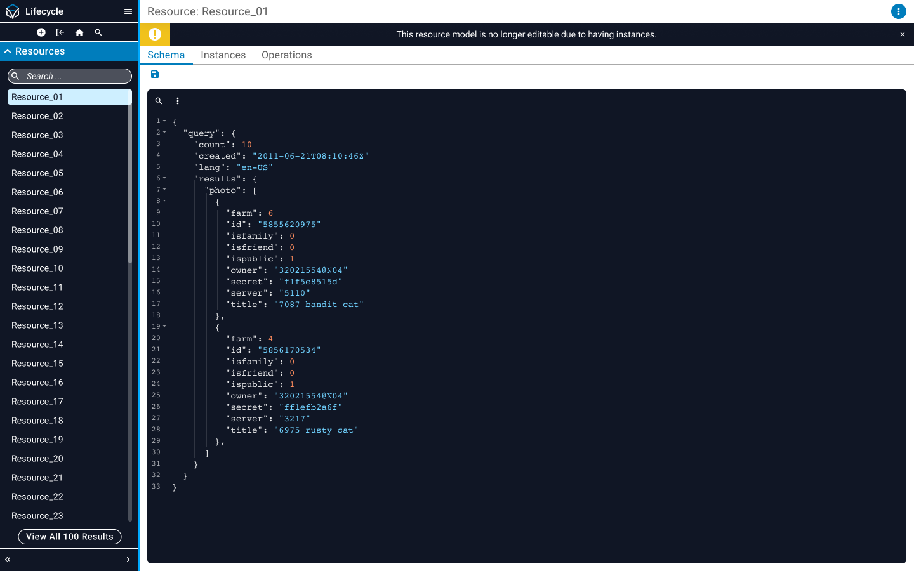
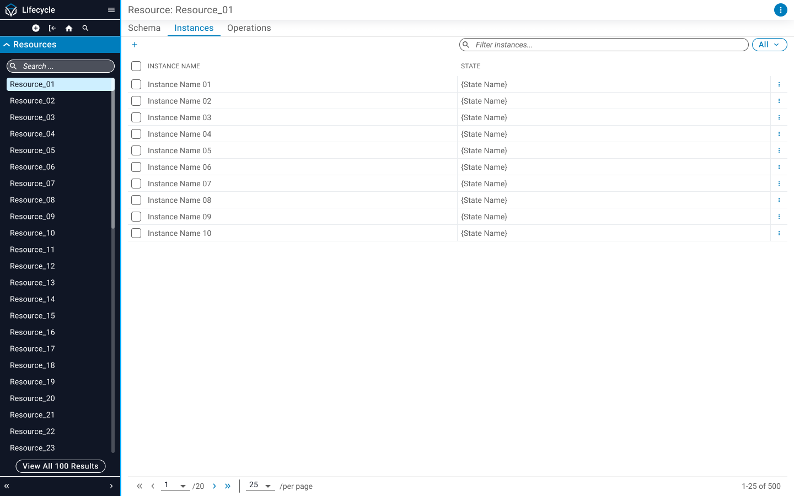
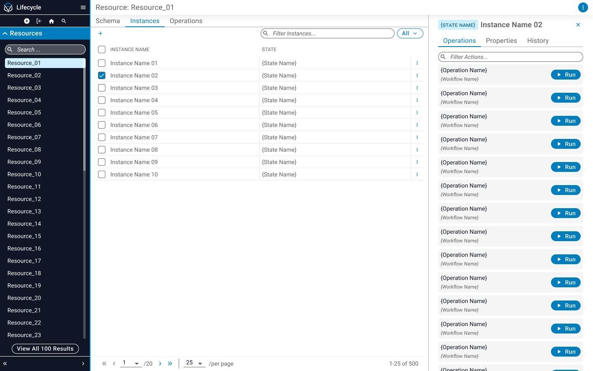
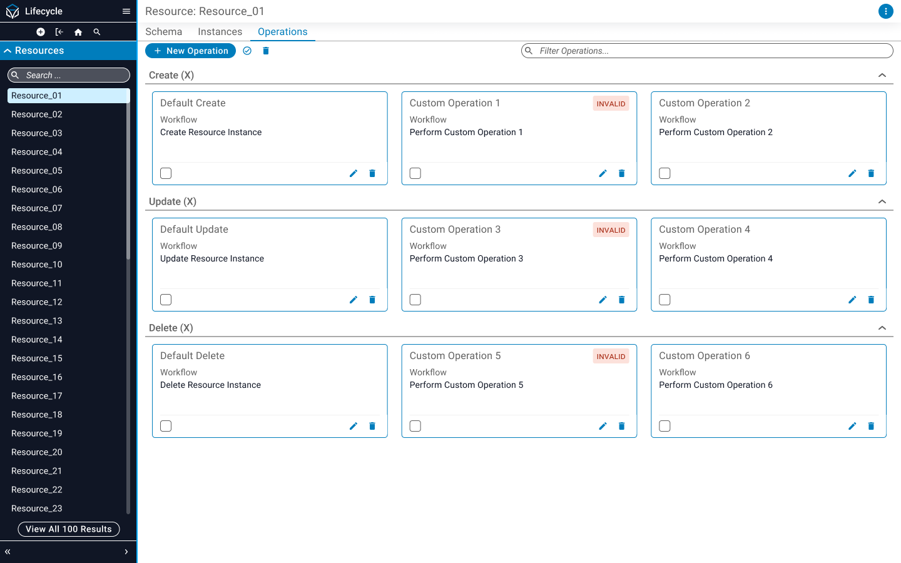
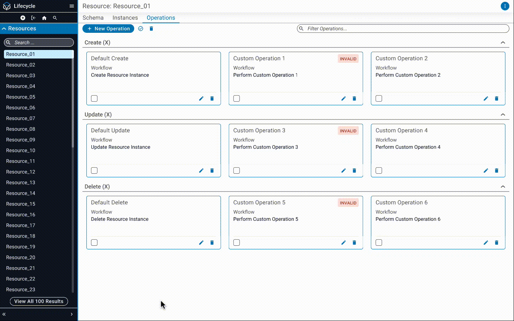

::: section block

## Context

To keep up with demand, today’s network architects need to automate large parts of their company's network infrastructure, while also **maintaining records of all changes made to the network** before and after automations are deployed. This process ensures consistency in the network, reduces manual errors and allows for any affected parts of the network to be rolled back to **prevent potential outages due to misconfiguration**.

While automation tools such as the Itential Automation Platform make it easy to design, build and run end-to-end workflows that perform otherwise manual network management tasks, **the automation itself is ethereal**. That is to say, once an automation run is complete, **the platform relies on an external system to record any of the changes that were made** as the platform itself does not have an intuitive way to store this data.

:::

::: section block

## Solution

Lifecycle Manager is a web application designed to streamline the process of **tracking and managing entities** (called "resources") that have a defined lifecycle within an organization. The app provides users with the ability to **create, view and update resource instances** based on a schema that is defined by the user. These individual entities, called "instances", can be interfaced with via "actions" for managing instance state. These actions are simply defined by automations that a user can create through the Itential Automation Platform's Automation Studio application, which are designed to be reusable and modular.

For a practical, non-networking related example of how this works, let's create a resource called **"Person"**. This Person resource is defined by a schema that says a Person must have a **first name, last name, and age**. The schema enforces that the names must be text (strings) and that the age must be a number. We can now create an action called **"Create Person."** This action should reference an existing automation, which creates an instance of a Person with the name "Nick Sinclair" who is 23 years old. However, Nick's birthday was actually this past August. We should run the **"Celebrate Birthday"** action on this instance to increment Nick's age by 1 and make him 24 years old. This is the essence of what building and maintaining entities using Lifecycle Manager is all about.

:::

::: section full-image

## Resource Schema Page

:::

::: section full-image

## Resource Instances Page

:::

::: section full-image

## Resource Instance Details Page

:::

::: section full-image

## Resource Operations Page

:::

::: section full-image

## Create Operation Prototype

:::

::: section block

## Contribution

I operated as the lead (and only) designer of this application. My work largely involved:

- **Developing the information architecture** of the application with members of the software architecture team.
- **Iterating on user flows** derived from stories presented by product management.
- **Building production grade UI designs** in Figma to then be consumed by the engineering team.

At this time, the Lifecycle Manager application is unreleased. Upon release, plans exist to conduct moderated usability testing on specific user flows.

:::

::: section block

## Disclaimer

_Due to circumstances related to my employment, I am limited in what I can show for this project. I do not claim to own any of the work shown here as it is all property of Itential._

:::
