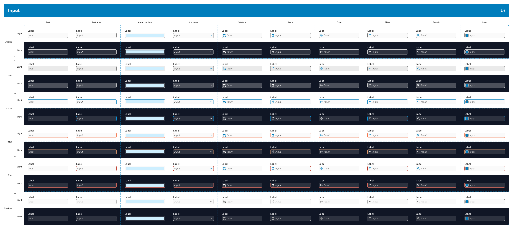

::: section block

## Overview

With Itential transitioning to a SaaS model and dedicating more resources toward a robust cloud offering, the time could not have been more perfect for the team to **reevaluate the state of the design system** and **amerliorate many of the inundated design decisions** that plagued it.

:::

::: section block

## Contribution

I operated as a supporting designer on this project. Some of my responsbilities included:

- **Leveraging variants, interactive components, component properties and nested instances** to create flexible and versatile components in Figma.
- **Revamping the color library organization** using a role-based approach to support theming capabilities.
- **Testing component responsiveness, composability, interactivity and reusability** to ensure a high-quality designer experience.
- **Writing comprehensive spec sheets** that highlight component formatting, behavior and states for development use.
- **Collaborating closely with the development team** to bring the components and their interactions to life.
- **Quality testing developed components** to ensure that they met the defined specs.
- **Maintaining the overall library using Figma's version control system** to avoid component breakage and other negative downstream effects.
- **Educating other designers on the team** about effective component use and best practices.

:::

::: section block

## Components

Each component was built with **reusability and composability** in mind. **Variants and slots** were heavily utilized in order create a system that scales with the evolving needs of the UI designers on the team. In many cases, **base components** were created so that they could house shared properties that were accessible across different variants using **nested instances**. **Variant tables** were generated for each type of component to allow other designers to understand the possible usable combinations when building out interfaces.

The following images highlight a few examples of the high-quality components we were able to produce using these practices.

:::

::: section full-image

## Accordion

:::

::: section full-image

## Chip

:::

::: section full-image

## Inline Note

:::

::: section full-image

## Input (Base)

:::

::: section full-image

## Input

:::

::: section full-image

## Notification (Base)

:::

::: section full-image

## Notification

:::

::: section full-image

## Tab

:::

::: section block

## Specifications

A **specification sheet** was created in Figma for each component type in order to communicate to development, as well as to other designers, information about the component's format, behavior and state. These specs would serve as a **singular source of truth** for development related tasks, resulting in a streamlined handoff with engineering.

:::

::: section full-image

## Specification Sheet Example - Notification

:::

::: section block

## Theming

Prior to this refresh, our team's previous design system had an unorganized and limited color library. The actual palette was only concerned with base colors and was **missing a number of tints and shades** that would have been helpful for creating depth and variance in our interfaces. There were also an **excessive amount of accents relative to the number of neutrals** (there were only two usable grays along with white and black). Colors were also defined inconsistently; some colors would be defined by a **token** (like "primary" or the incorrectly spelled "avacado") while others were defined by a **role** (like "success" or "error"). These issues along with the desire to implement a robust theming strategy served as the perfect opportunity to revamp the entire color library.

All base colors had **tints and shades picked out programmatically** and were **defined using specific token names**. From there, the amount of accents were **cut in half** in order to build a more focused palette. Additonally, **contrast tables** were created so that the team could determine if common combinations of text and background colors met accessiblity thresholds at a glance.

:::

::: section full-image

## Previous Color Organization

:::

::: section full-image

## Color Group Example

:::

::: section full-image

## Contrast Table Example

:::

::: section block

## Usage Tables

In order to support a scalable theming strategy, the defined color tokens were also **aliased by distinct color roles that would remain the same regardless of theme**.

For an example of how this works, let's look at a common role like `$background`. Every UI needs a background color regardless of which theme may be applied. However, a light theme UI would certainly have a different background color than a dark theme UI. The concept of a background is **theme-independent** while the specific backrgound color is **theme-dependent**.

This extra layer of abstraction helped us to **establish a common language with the development team**. This also eased the burden on both teams as they **no longer had to remember which specific color tokens to use for component styles** on a per theme basis. This also gives us the **flexibility to create additional themes in the future**, such as a high-contrast theme or user-defined themes for white-labeling.

:::

::: section full-image

## Usage Table Example - Light - Button

:::

::: section full-image

## Usage Table Example - Dark - Button

:::

::: section block

## Disclaimer

_Due to circumstances related to my employment, I am limited in what I can show for this project. I do not claim to own any of the work shown here as it is all property of Itential._

:::
