::: section block

## Details

The **Georgia Tech Atrium**, based in **New York City**, aims to **transform** to the various needs of its patrons as well as **resonate** with them **programmatically** and **socially**.

:::

::: section block

## Introduction

As a team comprised of two industrial design students and two architecture students, we developed a concept for an **interactive environment** that promotes and facilitates **continued education and growth**.

This initiative originated from the executive team at the **Georgia Institute of Technology**, and became the basis for our semester-long studio project. Our goal was to **identify the primary and secondary stakeholders** for our solution, **gather insights** through user research, and use those insights to **drive our solution**.

:::

::: section block

## Contributions

On this team, my primary contributions included **conducting interviews** with stakeholders, **developing user experience flows** for spatial interactions, **designing graphic collateral** for digital and physical presentations, **creating detailed and realistic still renderings** of elements of the atrium space, and **rendering complex yet clear animations** of the various interaction scenarios.

The team members I collaborated with on this project were [Lucy Kates](https://lucykatesdesign.com/), [Jane Ilyasova](https://www.linkedin.com/in/jane-ilyasova-007a19159/), and [Monica Rizk](https://issuu.com/mrizk/docs/rizkmonica_portfolio).

:::

::: section full-image

## The Warehouse

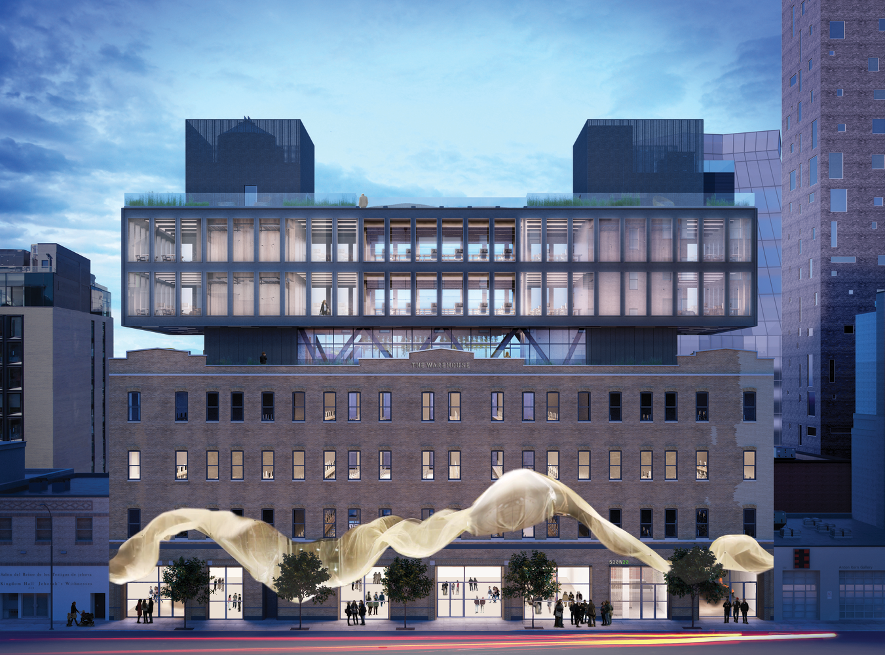

:::

::: section block

## Research

We began by identifying a wide variety of **potential stakeholders** that may be affected by the prospect of an open educational space. From there, we narrowed down our list to a handful of stakeholders we specifically wanted to focus on, and created **personas** for each one.

:::

::: section full-image

## Future Students

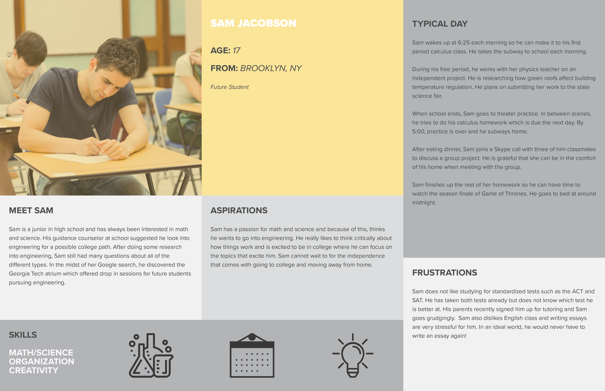

:::

::: section full-image

## Online Students

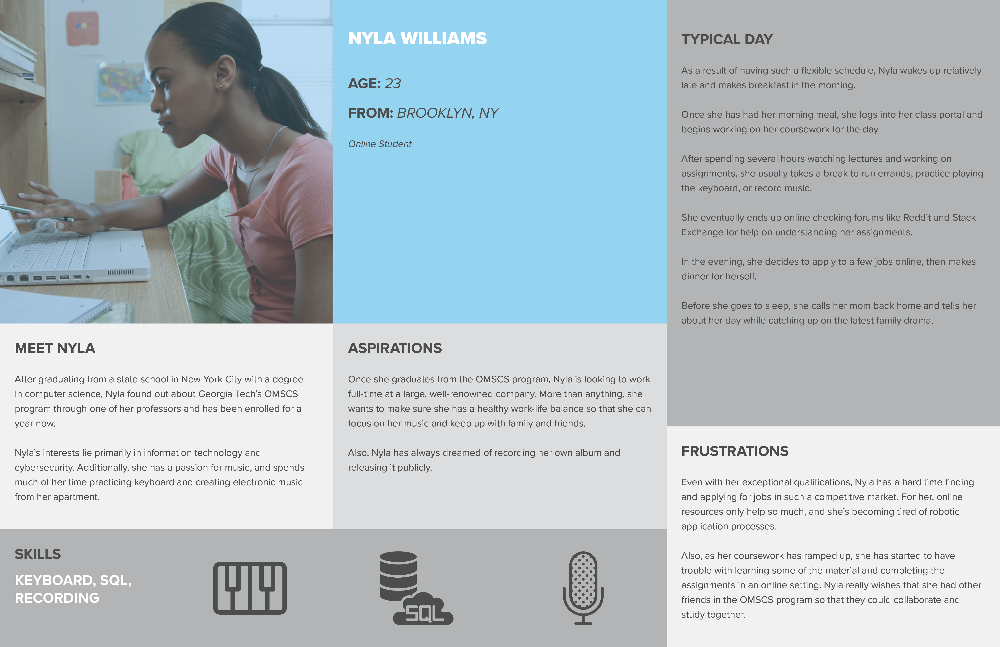

:::

::: section full-image

## Alumni

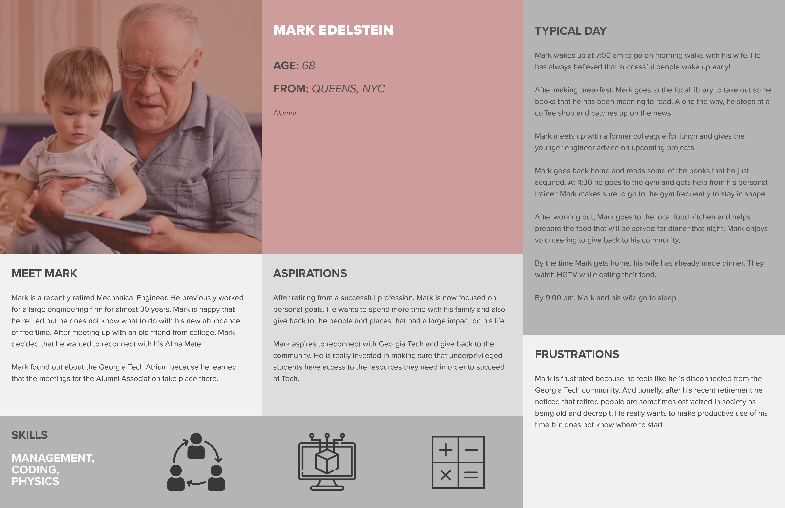

:::

::: section block

## Rationalization

After **reaching out** to actual people that fell into our stakeholder groups and **interviewing them**, we then took this a step further by developing a **stakeholder map**. This map outlines the various **actions** each stakeholder could potentially want to do in the space, the types og **services** and **contexts** that facilitate those actions, as well as the **resources** they may utilize.

:::

::: section full-image

## Stakeholder Map

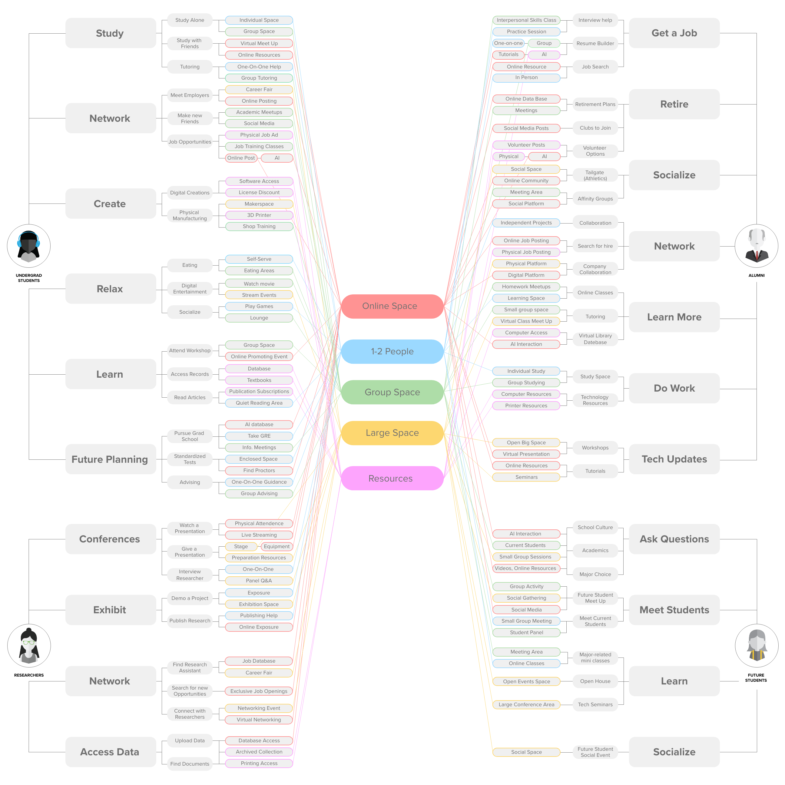

:::

::: section block

## Storyboards

The insights we gained from our interviews with users allowe dus to develop in-depth **storyboards** that outline a few typical interactions that we wanted to include within the space.

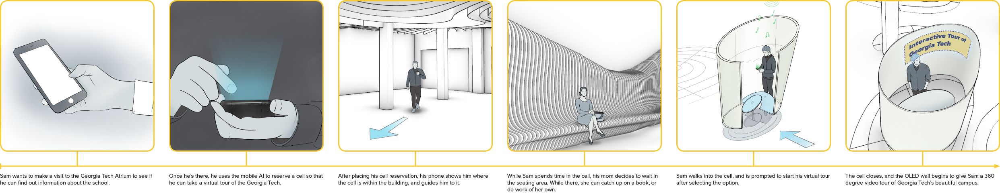

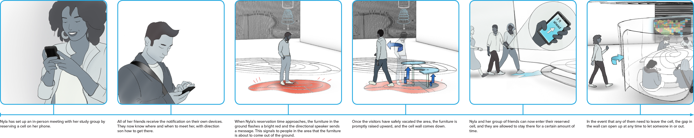

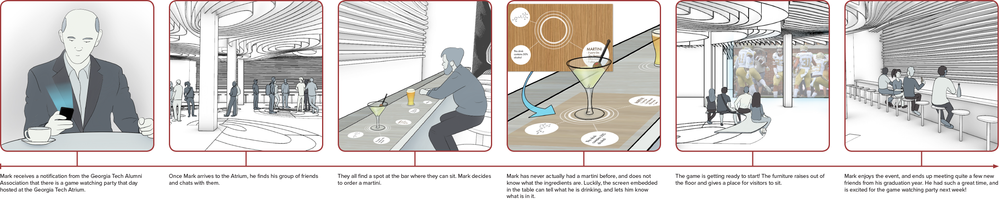

:::

::: section block

## Solution

After multiple interactions, we were able to visualize a **programmatic solution** to address many of the stakeholder needs through **renderings** of the space and **animations** that describe detailed scenarios.

:::

::: section full-image

## Innovation Theater | Interior

:::

::: section full-image

## Cell Interior

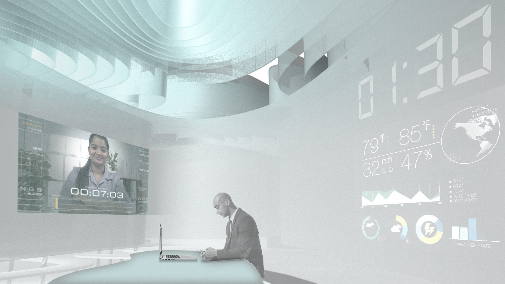

:::

::: section full-image

## Maker's Space

:::

::: section full-image

## Social Bar

:::

::: section full-image

## Interactive Pop-Up

:::

::: section full-image

## Exterior Installation (Night)

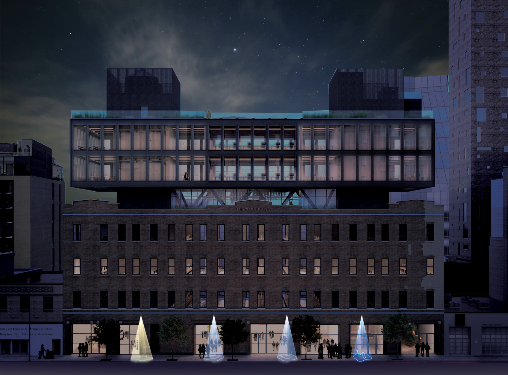

:::

::: section full-image

## Exterior Installation (Day)

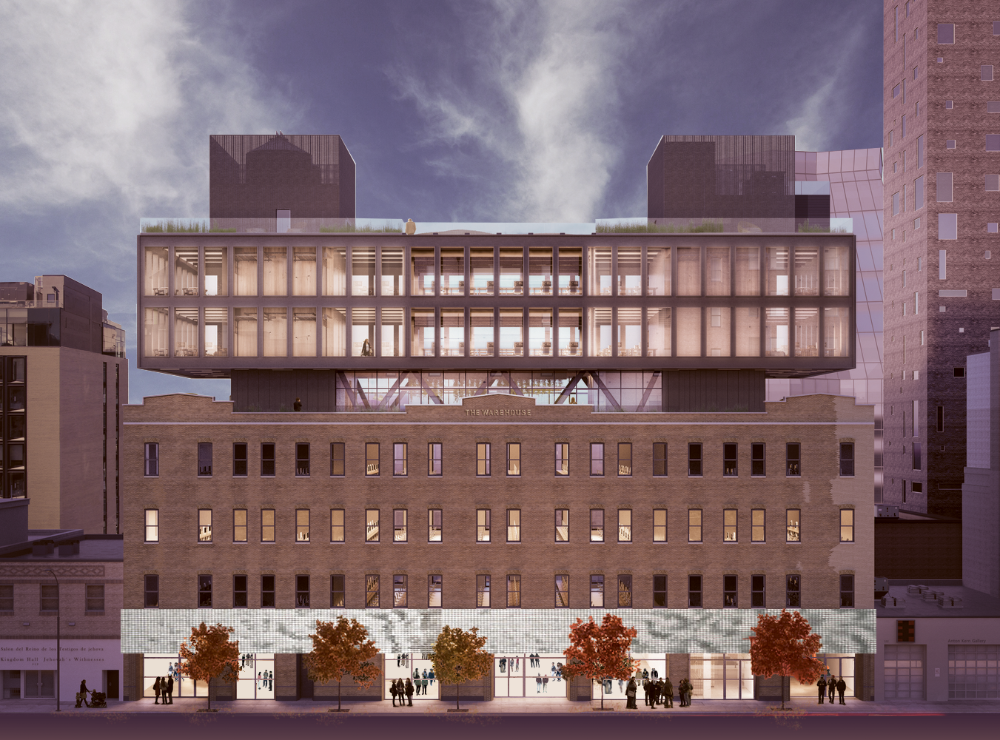

:::

::: section full-image

## Site and Structure

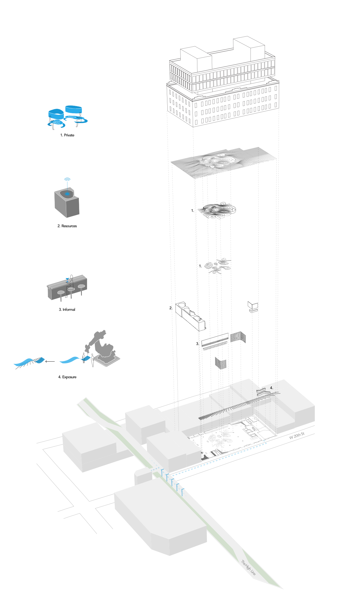

:::

::: section full-image

## Video Presentation

`youtube: [Pulse Atrium](http://www.youtube.com/watch?v=jUAW-523Au0)`

_Many thanks to my teammates Lucy Kates, Jane Ilyasova, and Monica Rizk._

:::
