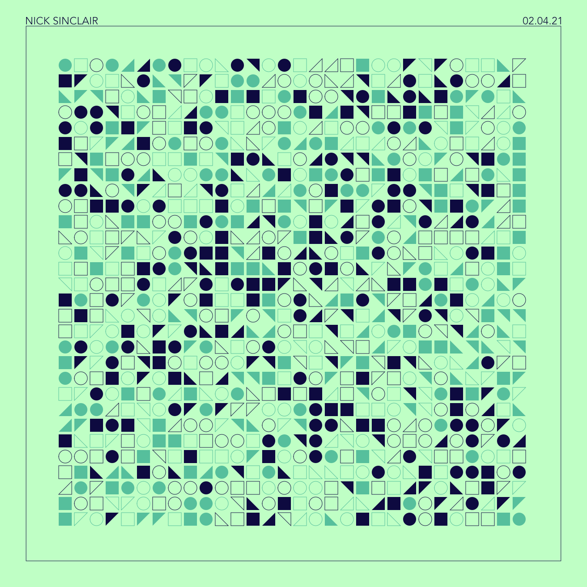
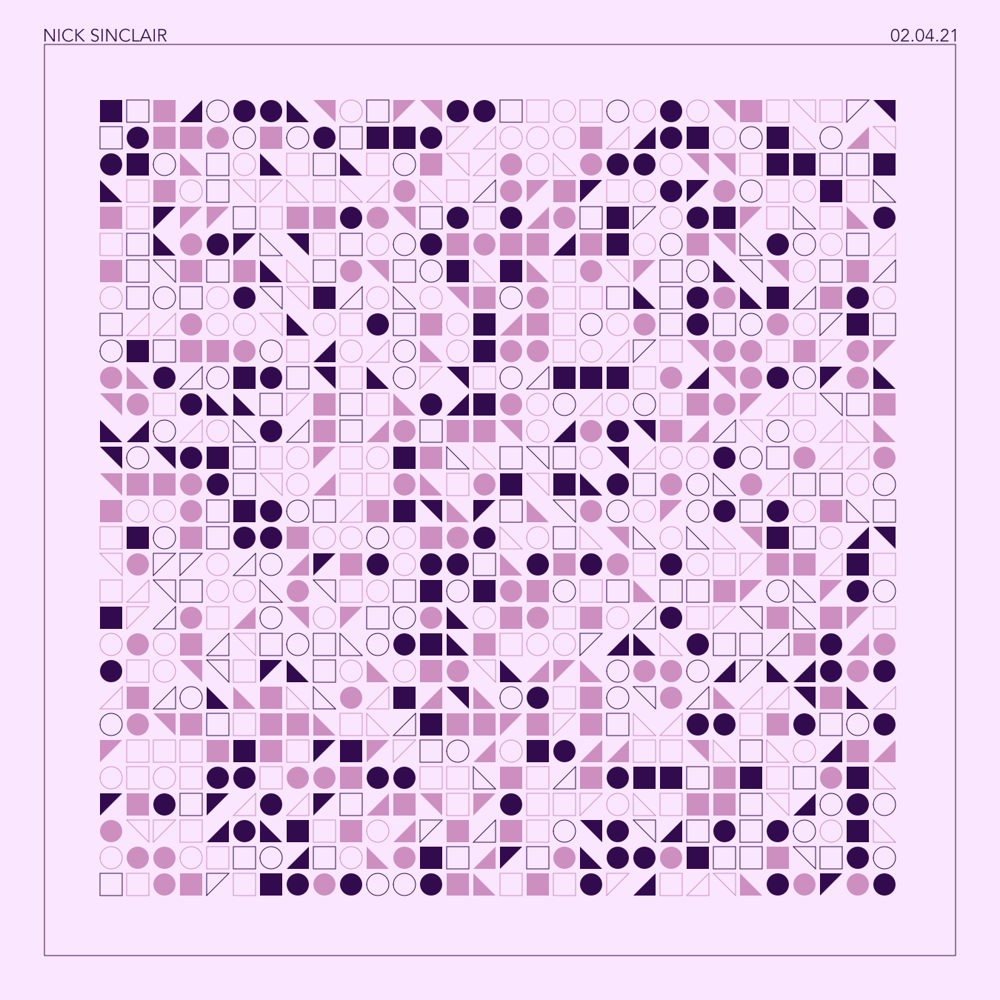
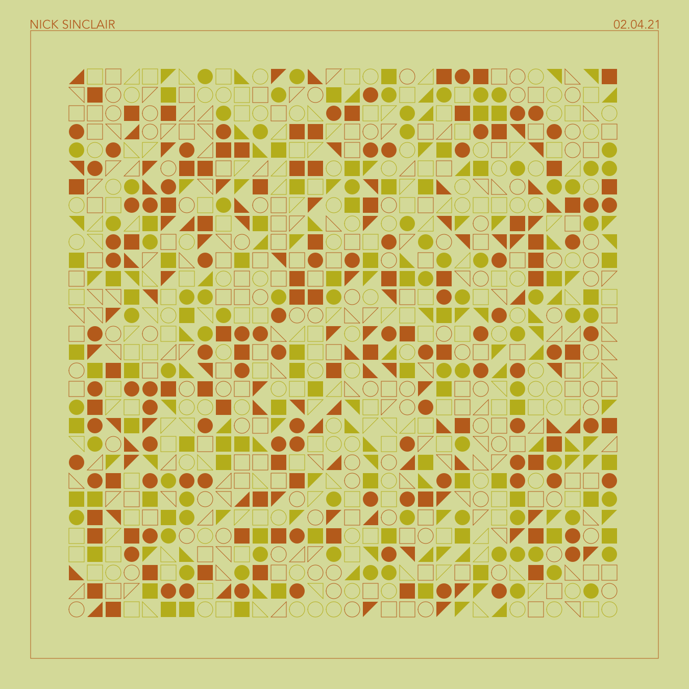

::: section block

## Details

[Interactive Website](https://nicksinclair.github.io/shape-grid)

Beware, the performance of this project is not the best due to using p5's SVG renderer.

:::

::: section full-image

## Refreshing

:::

::: section full-image

## Popping

:::

::: section full-image

## Blazing

:::
