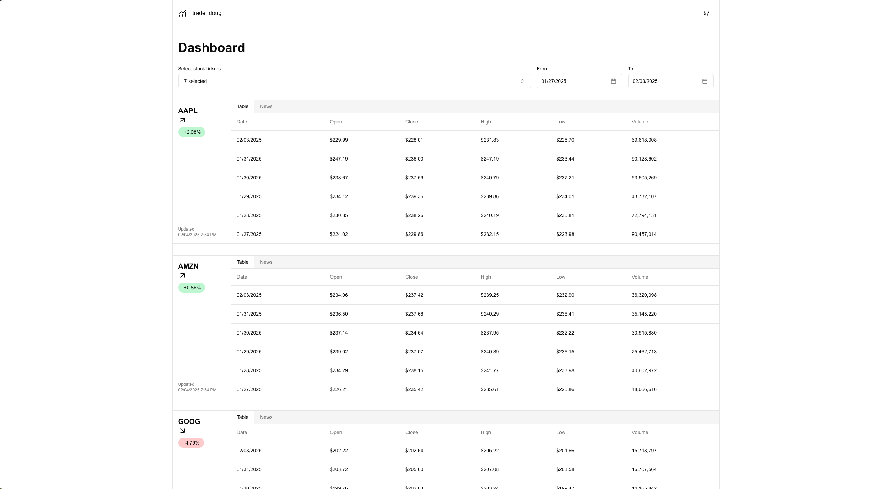

::: section full-image

:::

::: section block

## Details

[traderdoug.dev](https://www.traderdoug.dev)

I created this app as a way to learn more about the [Polygon.io stocks and reference data API](https://polygon.io/stocks).

This was inspired by my dad, who is a CPA that frequently checks how individual stocks are performing using a variety of different sources. I wanted to create an experience that allowed him to specify tickers and view the data in an easy to read format.

:::

::: section block

## Features

- View daily aggregate stock data in a table format
- Select specific tickers to view on your dashboard
- Filter daily aggregates by date range
- Access news articles about each stock

:::

::: section block

## Technology

This app was built using React, Next.js, and TailwindCSS.

I also created a serverless backend using Node.js.

Both the frontend and the backend were deployed to Vercel.

:::