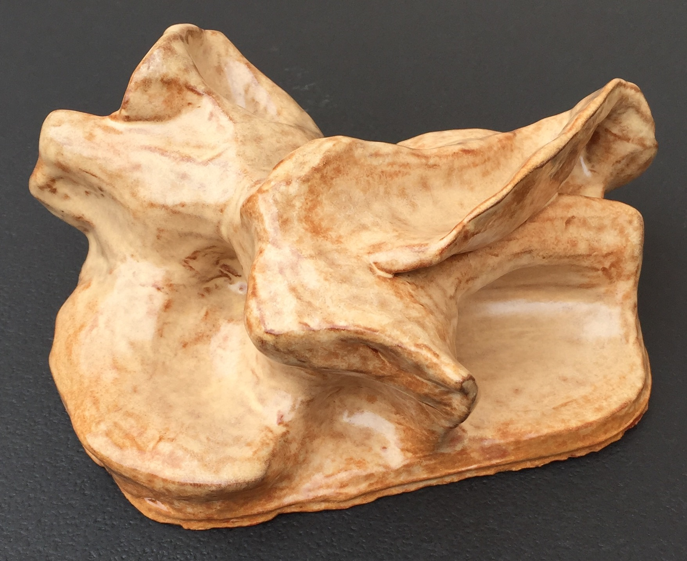
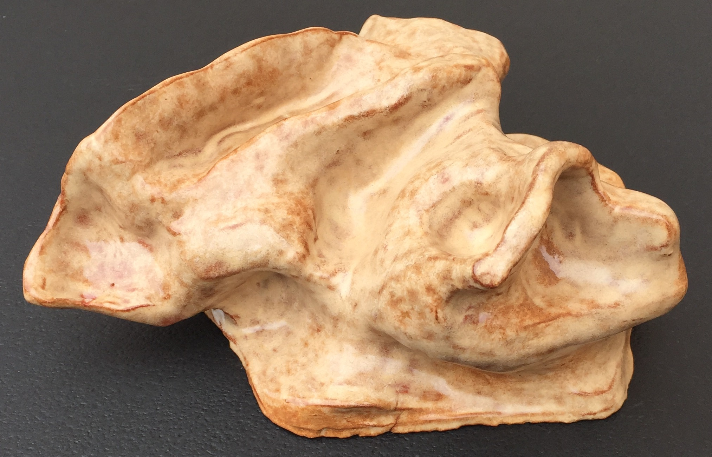
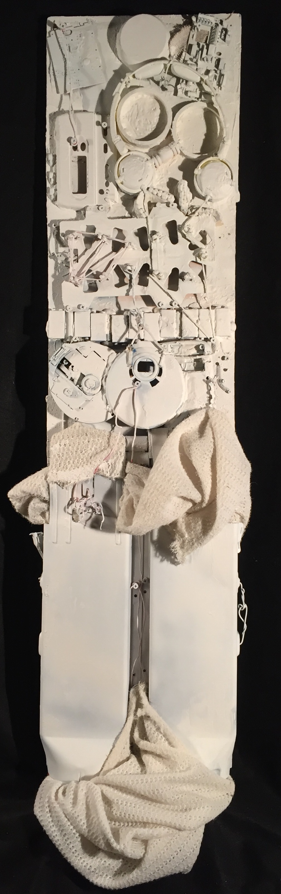
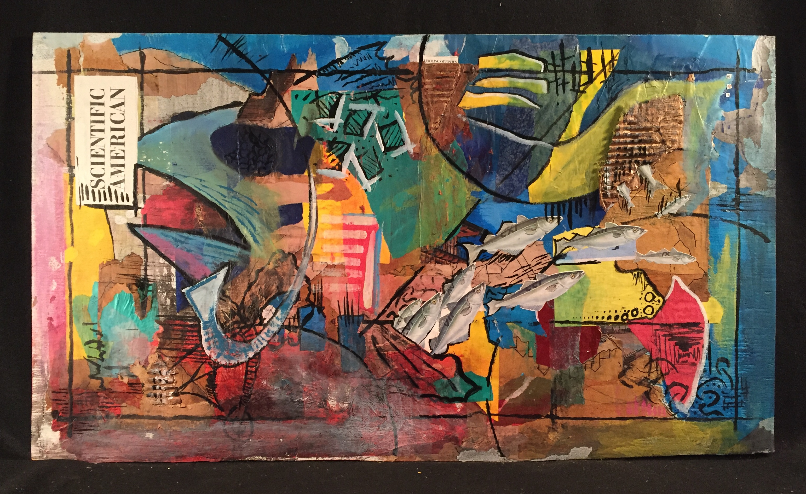
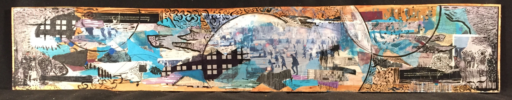
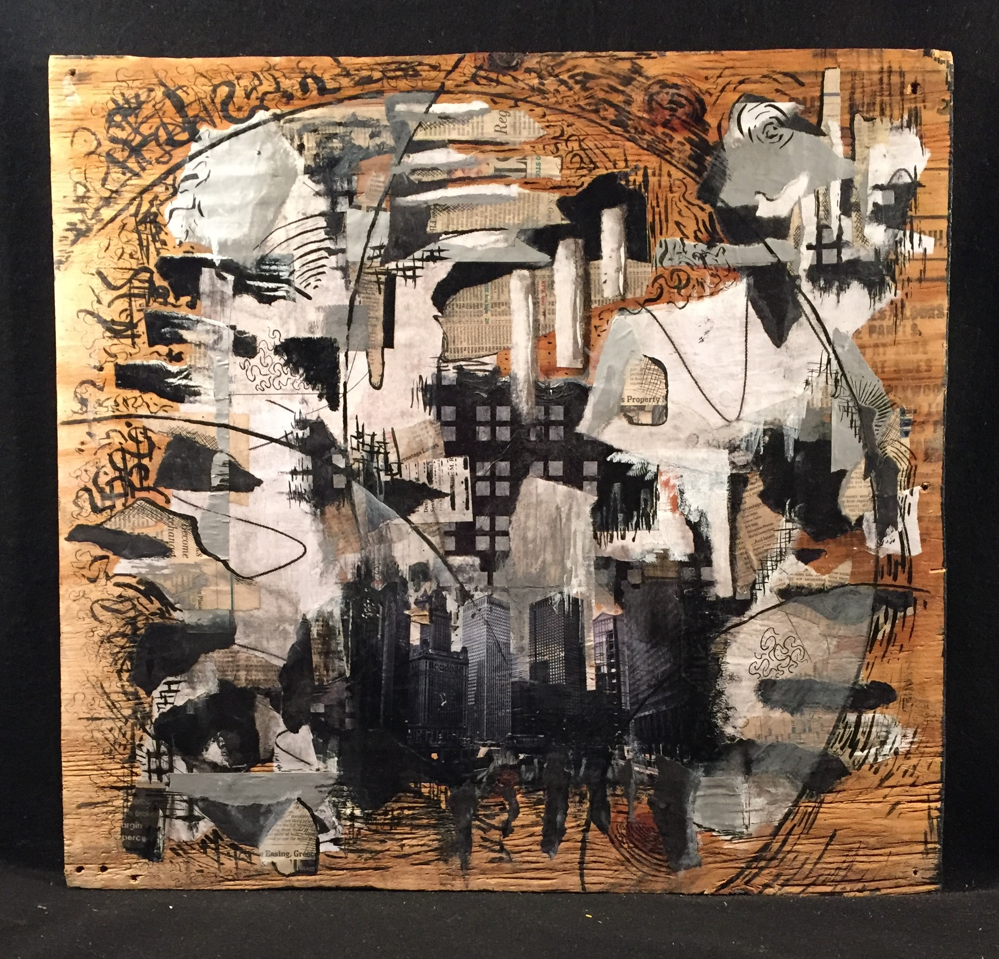
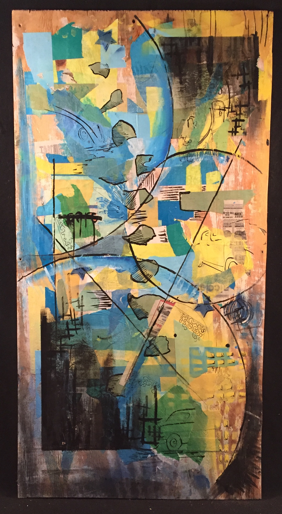

::: section full-image

## Form I

_Form I, glazed red earthenware. 2015-11. 7cm x 16cm 11cm._

:::

::: section full-image

## Divide

_Found objects and primer on plywood. 2015-10. 122cm x 30.5cm_

:::

::: section full-image

## Overfishing

_Paper, cardboard, magazine cutouts, ink, and acrylic on plywood. 2015-05. 91.5cm x 51.5cm._
:::

::: section full-image

## Snow

_Paper, acrylic, gouache, ink, and image transfer on plywood. 2015-03. 130cm x 24cm._

:::

::: section full-image

## White Noise

_Paper, image transfer, ink, gouache, and acrylic on plywood. 2015-03. 61cm x 65cm._

:::

::: section full-image

## Wreck

_Paper, acrylic, and ink on plywood. 2014-10. 118cm x 61cm._

:::
